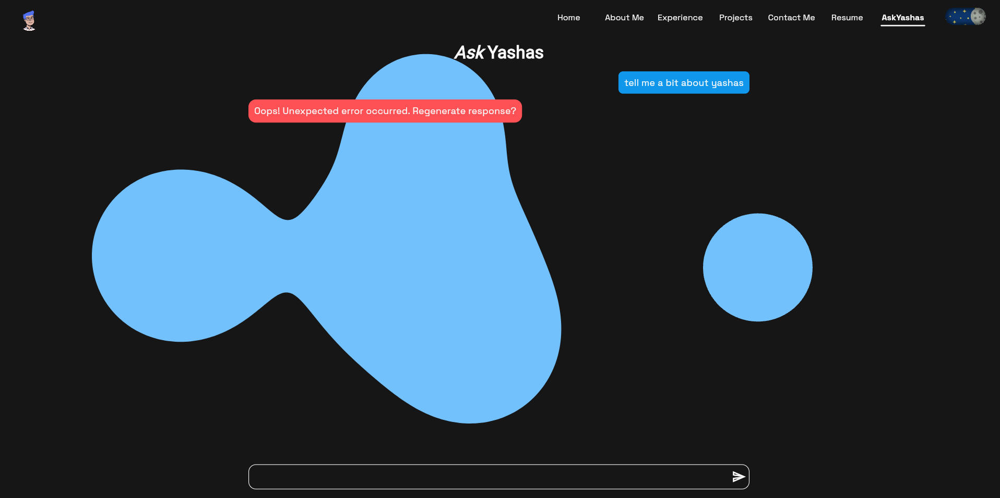

# 🤖 AskYashas – Your Personalized AI Sidekick

A personalized **Retrieval-Augmented Generation (RAG)** chatbot designed to answer questions about me(Yashas
Majmudar) with precision and context-awareness. It combines a powerful language model with a semantic search retriever
to fetch relevant information from curated knowledge; enabling grounded, factual, and context-rich responses. Whether
it’s facts, timelines, or personal achievements, AskYashas knows the story.

**Note:** You can use this repository as template to create your own RAG ChatBot. Just have to make a few
changes, [follow these steps ](#use-this-repo-as-template-)

---

## Features 🚀

- ⚡ **Serverless architecture** using FastAPI and LangChain
- 🧠 **Retrieval-Augmented Generation (RAG)** for factual, personalized Q&A
- 💬 **Memory-aware prompts** that adapt to conversational context
- 📚 **Custom vectorstore**  no external database needed
- 🤖 **LLM-powered** with Google Generative AI (Gemini flash 2.0)
- 🔁 **CI/CD pipeline** with GitHub Actions for automated deployments

---

## Tech Stack 🧱

| Layer            | Tech                 |
|------------------|----------------------|
| **Backend**      | FastAPI, LangChain   |
| **LLM**          | Google Generative AI |
| **Vector Store** | ChromaDB (local)     |
| **CI/CD**        | GitHub Actions       |
| **Deployment**   | Railway Serverless   |

---

## How it Works 🧩

1. **Information** → embedded via LangChain into ChromaDB vectorstore.
2. **Langchain** retrieves relevant chunks using similarity search from ChromaDB.
3. Constructs a custom prompt with context + conversation history.
4. Responds using Google’s LLM with precision and wit.

---

## Use this repo as template 🛠

1. Update data.txt with your data
2. Add variables
    ```bash
    export API_TOKEN=gemini-api-key
    # Optional. Key = (random key)
    # export BYPASS_KEY=Key
    ```
3. Run `vectorestore_generator.py` to generate ChromaDB Vectorstore
4. Replace URLs in allowed_origins in `SecurityMiddleware` or remove `app.add_middleware(SecurityMiddleware)` in
   `app.py`. Alternative you can not add the `BYPASS_KEY`.
5. Run `uvicorn app:app --host 0.0.0.0 --port 3000` to host api locally

---

## CI/CD ⚙️

- GitHub Actions automates vectorstore generation and deployment on every push to `main`.
- Easy to scale and deploy to serverless platforms.

---

## Use Cases 🎯

- Showcasing personal projects via conversational AI
- Fun resume companion
- Context-aware personal knowledgebase

---

## Folder Structure 🗂

```text
.
├── api/
│   ├── endpoints/
│   ├── utils/
│   ├── model/
│   └── constants.py
├── vectorstore/
├── app.py
├── requirements.txt
└── README.md
```

---

## Preview


